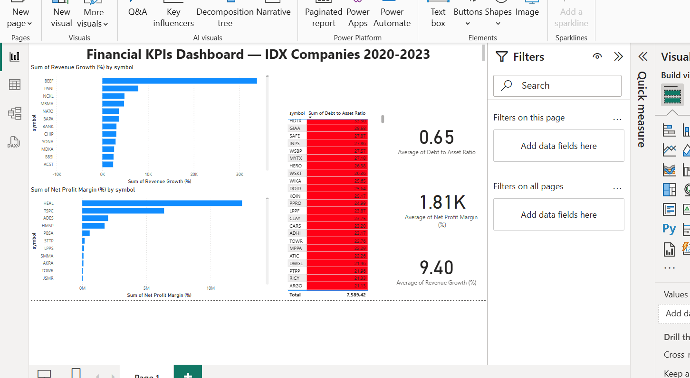

# 📊 Financial KPIs Dashboard — IDX Companies (2020-2023)

This project showcases the analysis and visualization of key financial metrics for IDX (Indonesia Stock Exchange) listed companies over the years 2020 to 2023.

The project includes:
- Data cleaning and transformation using **Python (Pandas)** in Google Colab
- Financial KPI calculation: **Revenue Growth (%), Net Profit Margin (%), Debt to Asset Ratio**
- Interactive dashboard creation in **Power BI**

---

## 🚀 Project Structure

| File | Description |
|:-----|:------------|
| `financial_data_cleaning.ipynb` | Jupyter Notebook for cleaning, preparing, and calculating financial KPIs |
| `Financial_KPIs_Dashboard_IDX_Companies.pbix` | Power BI file containing the interactive dashboard |
| `dashboard.png` | Preview image of the dashboard (uploaded for visualization in README) |

---

## 📈 Dashboard Overview

Here is a glimpse of the Financial KPIs Dashboard:

> 📌 The dashboard highlights top-performing companies based on Revenue Growth, Net Profit Margin, and Debt to Asset Ratio.

---

## 🛠️ Tools & Technologies Used
- **Python** (Pandas, NumPy)
- **Google Colab**
- **Power BI**
- **GitHub**

---

## 📚 Key Insights
- Identified companies with the highest and lowest **Revenue Growth** between 2020-2023.
- Analyzed **Net Profit Margins** across multiple sectors.
- Calculated and visualized **Debt to Asset Ratios** to assess financial risk exposure.

---

## ✨ Future Improvements
- Add sector-wise segmentation for deeper comparative analysis.
- Implement Year-over-Year (YoY) trend analysis.
- Integrate predictive modeling for future KPI forecasting.

---

## 📬 Contact
If you have any questions or feedback, feel free to connect:

- GitHub: [krishnatejakotla](https://github.com/krishnatejakotla)
- LinkedIn: [Krishna Teja Reddy Kotla](https://www.linkedin.com/in/krishnatejakotla/)

---

# ✅ Quick Instructions for Viewers:
- Download the `.pbix` file to explore the dashboard in Power BI Desktop.
- View and run the `.ipynb` file to see the data cleaning and KPI calculations.
- Explore the dashboard preview directly below!

---

# ⭐ If you like the project, feel free to give it a **star**!
